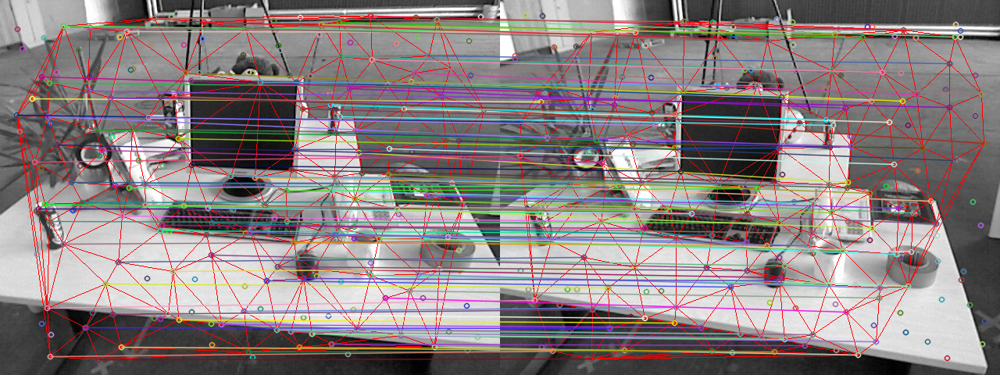
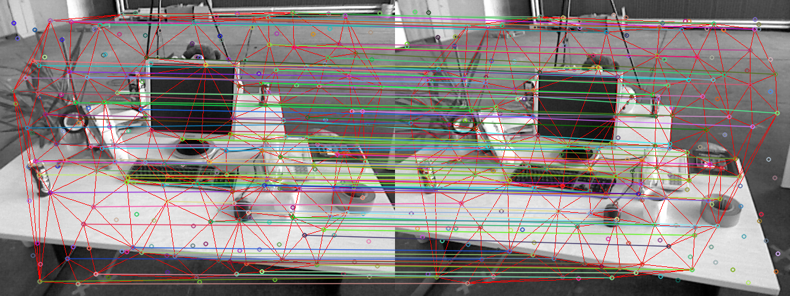

# ORB-DTM
Feature Matching based on ORB and Delaunay Triangulation Matching

## 原理与思路
对初始的orb匹配点对构建Delaunay三角网络,分别构建两帧图像的Delaunay三角网络的边矩阵,通过计算边矩阵的差异,使用三角约束,进行误匹配点对的剔除工作

## 代码框架
+ include
    + Vertex.h : Dealunay三角网络的顶点,是最基本的单元
    + edge.h : Delaunay三角网络的边,由两个顶点构成一条边
    + triangle.h : Delaunay三角网络的三角形单元,由三条边构成一个三角形
    + delaunay.h : Delaunay三角网络,由多个三角形构成一个三角网络,使用'逐点插入法'构建Delaunay三角网络
    + DTMunit.h : 输入特征点点集,使用暴力匹配进行初始的特征匹配,构建特征点的Dealaunay三角网络
    + ORBextractor.h : 获取特征点均匀分布的ORB特征点
    + numeric.h : 基本数学运算
+ src (见相关的.h文件)
    + DTMunit.cpp
    + ORBextractor.cpp
+ example
    + orbextract.cpp : 对初始匹配的特征点对构建Delaunay三角网络,通过三角约束,进行误匹配剔除
## 编译环境
+ 使用C++进行项目开发,使用Cmake构建项目
+ 需要的库:Opencv3,Eigen3
+ 本人开发环境为Ubuntu系统,
## 运行结果
初始匹配

三角约束后的效果

## 联系方式
如果你对本项目感兴趣,对代码细节有疑惑,或者对利用三角约束进行图像配准感兴趣,请联系我进行交流
Email:luzhaozhang@foxmail.com